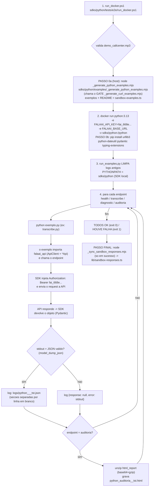

# FLUXO DE TESTES DA SDK PYTHON (`falaai-api`)
@version 1.0.0 | 30/09/2026 | MANUAL — nao e regenerado pelo exportador de exemplos
SDK: `D:\ProjetoFalaAI\FalaAI\FalaAI_api\sdks\python\` (pacote PyPI `falaai-api`, import `falaai_api`) · Docker da linguagem: imagem oficial `python:3.13`
Regra de fundo: `.opencode/rules/macro/modulos/falaai-api/sdk-fonte-unica.md` (tests/e2e = MANUAL)

> **v1.0.0 (30/09):** doc criado no PADRAO 3.1 (espelha o `_FLUXO_TESTE_SDK_NODE.md`) — fecha o gap: python era o unico SDK sem doc de fluxo. Runner = `run_examples.py` (Python, nao bash); PASSO 0b = `pip install` das deps no container.

## Scripts e arquivos usados (nomes e paths exatos)
| # | Script / Arquivo | Path completo | Papel no fluxo |
|---|---|---|---|
| 1 | `run_docker.ps1` v1.0.0 | `D:\ProjetoFalaAI\FalaAI\FalaAI_api\sdks\python\tests\e2e\run_docker.ps1` | WRAPPER (PowerShell): valida mp3 -> **PASSO 0a** (sync exemplos) -> sobe o Docker `python:3.13` (instala deps) -> **PASSO FINAL** (sync respostas) |
| 2 | `run_examples.py` v1.1.0 | `D:\ProjetoFalaAI\FalaAI\FalaAI_api\sdks\python\tests\e2e\run_examples.py` | RUNNER (Python, roda DENTRO do container): **limpa logs antigos**, executa os 4 exemplos via SDK, grava os logs JSON + `.html` |
| 3 | `_generate_python_examples.mjs` v1.4.0 | `D:\ProjetoFalaAI\FalaAI\FalaAI_api\sdks\python\examples\_generate_python_examples.mjs` | EXPORTADOR (**PASSO 0a**, roda no host): re-exporta os 4 exemplos da FONTE UNICA + **gera o README** (versao/data) |
| 4 | `_generate_curl_examples.mjs` | `D:\ProjetoFalaAI\FalaAI\FalaAI_api\sdks\curl\examples\_generate_curl_examples.mjs` | GATE interno (chamado pelo exportador python): valida cURL vs fonte unica — exit 1 se divergir |
| 5 | `sandbox-examples.ts` | `D:\ProjetoFalaAI\FalaAI\FalaAI_landing\lib\sandbox-examples.ts` | FONTE UNICA dos exemplos (8 linguagens x 4 endpoints, tokens `{{...}}`) |
| 6 | `health.py` · `transcribe.py` · `diagnose.py` · `audit.py` | `D:\ProjetoFalaAI\FalaAI\FalaAI_api\sdks\python\examples\*.py` | OS 4 EXEMPLOS GERADOS (exatamente o que o runner executa — nunca reescrito a mao) |
| 7 | `README.md` | `D:\ProjetoFalaAI\FalaAI\FalaAI_api\sdks\python\examples\README.md` | manual dos exemplos (**GERADO** pelo exportador v1.4.0 — versao/data) |
| 8 | `falaai_api/` (gerado) | `D:\ProjetoFalaAI\FalaAI\FalaAI_api\sdks\python\falaai_api\` | O SDK (openapi-generator): `ApiClient`/`Configuration`/`*Api` + `models/` — entra por `PYTHONPATH` (nao instala) |
| 9 | `demo_callcenter.mp3` | `D:\ProjetoFalaAI\FalaAI\FalaAI_api\sdks\python\tests\e2e\demo_callcenter.mp3` | audio do teste (1.3 MB) |
| 10 | `logs\python_<endpoint>_<ts>_tst.json` (+ `.html`) | `D:\ProjetoFalaAI\FalaAI\FalaAI_api\sdks\python\tests\e2e\logs\` | LOGS gerados pelo runner (**limpa os antigos a cada rodada**) |
| 11 | `VERSION.txt` | `D:\ProjetoFalaAI\FalaAI\FalaAI_api\VERSION.txt` | versao da API que o health devolve (`api_v1.21.49`) — SEM BOM |
| 12 | `_FLUXO_TESTE_SDK_PYTHON.md` (este doc) | `D:\ProjetoFalaAI\FalaAI\FalaAI_api\sdks\python\examples\_FLUXO_TESTE_SDK_PYTHON.md` | este doc |

## Requisitos do dev (inviolaveis)
- R-A: roda em Docker DA LINGUAGEM (`python:3.13`)
- R-B: roda os 4 exemplos GERADOS (`health/transcribe/diagnose/audit.py`) — nunca reescreve
- R-C: LOG = request (codigo do exemplo) + response (o que o SDK devolveu) + `.html` da auditoria
- R-D: chave `fai_668e6474b83dd24540860d9ab9df0b738f7171a0f5bd8179` hardcoded no runner (local-only)
- R-E: **PASSO 0 antes de tudo** — exemplos sincronizados com a FONTE UNICA

## Fluxo (com os nomes reais dos scripts)


## Comando (API no micro do dev)
```powershell
powershell -ExecutionPolicy Bypass -File "D:\ProjetoFalaAI\FalaAI\FalaAI_api\sdks\python\tests\e2e\run_docker.ps1" -BaseUrl http://host.docker.internal:8002 -Only all
# -Only: all | health | transcribe | diagnostic | auditoria
# health = publico (sem creditos) · transcribe/diagnostic/auditoria = consomem creditos da chave FAI
```

## Log (formato — secoes separadas por linha em branco, JSON valido)
```json
{
  "language": "python",
  "endpoint": "health",
  "generated_at": "2026-09-30T12:36:00Z",

  "request": "<codigo do exemplo .py, linhas escapadas como \n>",

  "response": { "o que o SDK python devolveu (model_dump_json, snake_case)" }
}
```
Falha: `"response": null, "error": "<stdout/stderr>"` · Auditoria: + `python_auditoria_<ts>_tst.html` (unzip de `html_report`)

## O que garantir
1. O exemplo importa o SDK (`falaai_api`) — NUNCA chamada HTTP/requests direta.
2. O request sai do SDK (Bearer fai_...) — a API responde — o SDK devolve — o runner grava o log.
3. PASSO 0 roda ANTES de qualquer teste (exemplos na ultima versao da fonte unica).
4. O runner LIMPA os logs antigos a cada rodada (so os da execucao atual ficam).
5. Refaco a qualquer momento: mesmo comando = mesmo comportamento (deterministico).

## Historico
- **v1.0.0 (30/09):** doc criado no PADRAO 3.1 (espelha `_FLUXO_TESTE_SDK_NODE.md`); fecha o gap (python era o unico SDK sem doc de fluxo). Runner `run_examples.py` v1.1.0 + wrapper `run_docker.ps1` v1.0.0 + exportador v1.4.0.